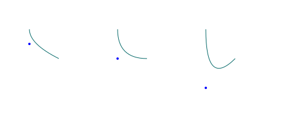
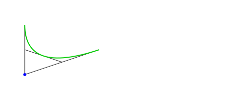
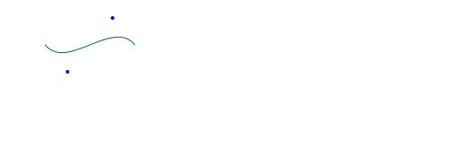
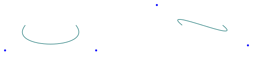
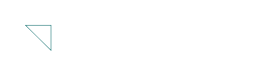
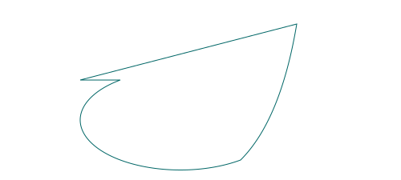
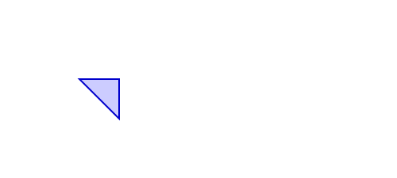

`<path>`元素用来绘制多种图形的组合，线段，弧线，曲线等等。可以填充也可以不填充。`<path>`元素几乎是最牛的一个SVG元素，也是最难掌握的一个元素。

# Path 例子

让我们从一个简单的例子开始:

```HTML
<svg xmlns="http://www.w3.org/2000/svg"
    xmlns:xlink="http://www.w3.org/1999/xlink">

    <path d="M50,50
             A30,30 0 0,1 35,20
             L100,100
             M110,110
             L100,0"
          style="stroke:#660000; fill:none;"/>    
</svg>
```


上图中包含了一个弧线和两段线段，同时第二个线段并没有与第一个弧线与线段相连。

所有`<path>`元素中指定的内容都在d属性中。d属性包含了绘制指令。在上面的例子中，M代表“移动至”命令，A代表“弧线”命令，L代表“线段”命令。这些命令会让“虚拟的笔”移动然后绘制图形。

# 设置和移动笔

`<path>`中d属性的第一个指令总是“移动”命令。在你绘制任何东西之前都需要将笔移动至某个位置。通过M命令完成：

```HTML
<svg xmlns="http://www.w3.org/2000/svg"
    xmlns:xlink="http://www.w3.org/1999/xlink">

    <path d="M50,50"
          style="stroke:#660000; fill:none;"/>
</svg>
```
例子中移动笔到50,50，之后的命令会从该点开始绘制。

# 线段

绘制线段大概是`<path>`里最简单的命令了。用L或者l命令完成：

```HTML
<svg xmlns="http://www.w3.org/2000/svg"
    xmlns:xlink="http://www.w3.org/1999/xlink">

    <path d="M50,50
             L100,100"
          style="stroke:#660000; fill:none;"/>
</svg>
```

上栗会绘制一条从50,50到100,100的线段：


L和l的区别在于大写L绘制的点是一个绝对的点，而小写l则绘制的是一个相对的点。相对的点绘制的时候是笔的点+给定的点。比如笔此时的点是50,50，如果用的l100,100，绘制的点会变成50+100,50+100 = 150,150。用L100,100的话那就是100,100。

# 绘制会移动笔

Path图形绘制的时候总会从上一个结束的点开始绘制到下一个点。每次绘制都会更新结束点，每一个命令执行后笔结束的点就会成为下一个命令绘制时开始的点。

# 弧形
`<path>`画弧线用A或者a，与线段一样，A是绝对点，a是相对点：

```HTML
<svg xmlns="http://www.w3.org/2000/svg"
    xmlns:xlink="http://www.w3.org/1999/xlink">

    <path d="M50,50
             A30,50 0 0,1 100,100"
          style="stroke:#660000; fill:none;"/>
</svg>
```


从点50,50开始绘制到点100,100(A的最后一个参数)。

弧形的半径由A的第一个参数指定。其中前面一个是rx(x轴的半径)，第二个是ry(y轴半径)。rx和ry值相同的话会绘制圆形弧线。rx和ry不同则会绘制椭圆。上面的例子是ry30,ry50。

第二个参数设置的X轴旋转度。设置弧线的x轴相对于普通x轴的旋转角度。上面设置的0，大部分情况下你都不需要改变它。

第三个和第四个(第一个要是算两个的话就是第四第五个)参数代表large-arc-flag(角度大小)和sweep-flag(弧线方向)，large-arc-flag决定了绘制的弧线大小(0表示小弧度，1表示大弧度)，下面是4个不同的例子：

```HTML
<path d="M40,20  A30,30 0 0,0 70,70"
    style="stroke: #cccc00; stroke-width:2; fill:none;"/>

<path d="M40,20  A30,30 0 1,0 70,70"
    style="stroke: #ff0000; stroke-width:2; fill:none;"/>

<path d="M40,20  A30,30 0 1,1 70,70"
    style="stroke: #00ff00; stroke-width:2; fill:none;"/>

<path d="M40,20  A30,30 0 0,1 70,70"
    style="stroke: #0000ff; stroke-width:2; fill:none;"/>
```


4个不同的弧线都从40,20开始绘制到60,70(应该是70,70作者写错了)。一个大弧形，一个小弧形，两个相反的大弧小弧。large-arc-flag决定绘制的是大还是小。sweep-flag决定绘制的是否与x轴相反。实际上，sweep-falg控制的是弧形绘制时的方向(顺时针和逆时针)，效果很像镜像。

第一个是黄色的，小弧形，非镜像：


第二个是红色的，large-arc-flag设为1，这样会有两个不同的弧形：


蓝色和绿色和黄红的相同，只不过sweep-flag设为1则变成了镜像绘制。

# 二次贝塞尔曲线

`<path>`里也可以画二次贝塞尔曲线。用Q或者q命令开头(同线段L)：


```HTML
<path d="M50,50 Q50,200 100,100" 
      style="stroke: #006666; fill:none;"/> 
```


例子中画了一个从50,50点开始到100,100点结束的二次贝塞尔曲线，有一个50,200的控制点。控制点是Q的第一个参数。

控制点会像一个磁铁一样拉着曲线走。越靠近控制点，就越会被吸引，也就越靠近控制点，几个不同的例子:



实际上，如果你绘制一条从控制点到开始点的线段，然后绘制另一条从控制点到结束点的线段，之后连接第一条线段的中间到第二条线段的中间就会得到一条曲线的横切线：




# 三次贝塞尔曲线

绘制三次贝塞尔曲线可以用C或者c(同L)。三次贝塞尔和二次贝塞尔差不多，只不过是有两个控制点:

```HTML
<path d="M50,50 C75,80 125,20 150,50"
      style="stroke: #006666; fill:none;"/> 
```



可以试试绘制一些其他的曲线：




# 闭合路径

`<path>`元素有一个快捷闭合路径的命令。用Z或者z(没有区别)：

```HTML
<path d="M50,50 L100,50 L100,100 Z"
    style="stroke: #006666; fill:none;"/>
```


# 组合命令

你可以组合多种不同的命令:

```HTML
<path d="M100,100
         L150,100
         a50,25 0 0,0 150,100
         q50,-50 70,-170
         Z"
      style="stroke: #006666; fill: none;"/>
```

例子中绘制了一条线段，一个弧线一个二次贝塞尔曲线然后闭合：




# 填充路径

用CSS fill可以填充路径：

```HTML
<path d="M100,100 L150,100 L150,150  Z"
      style="stroke: #0000cc;
             stroke-width: 2px;
             fill  : #ccccff;"/>
```



# 标记(marker)

你可以把marker用在`<path>`上。Marker是一个在开始中间和结尾处会出现的小符号，展示整条路径的方向。

会在marker元素章节详细解释。

# 快捷记数

如果你需要写多次相同的命令，你可以省略命令字符，只写需要的额外参数：

```HTML
<path d="M10,10   l100,0  0,50  -100,0  0,-50"
      style="stroke: #000000; fill:none;" />
```

上面例子是l命令为例的，只写了一次l。对于其他命令也一样有用:


