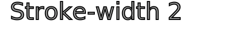
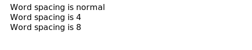

`<text>`元素用来在SVG上绘制文字。

# Text 例子

```HTML
<svg xmlns="http://www.w3.org/2000/svg"
     xmlns:xlink="http://www.w3.org/1999/xlink">

    <text x="20" y="40">Example SVG text 1</text>
</svg>
```

例子中定义了一段文字位置在x=10 y=40处。文字显示的是“Example SVG text 1”。


# 文本定义

在深入了解SVG text之前，下面三条定义最好了解一下：

- 字形

    字形是字母或者符号的虚拟展示。字母"a"可以展示出多种不同的字形，因为有多种不同的虚拟展示可以代表字母"a"。

- 字体

    字体是一系列字母和符号的虚拟字形集合。

- 字符

    字符是字母或符号的二进制表示。一个字符需要1个或者多个字节来表示。当计算机渲染字符时就会将字符渲染出字体内对应的字形。


# 文本位置

文本的位置由`<text>`中的x和y属性决定。x属性决定了文本距离左边的距离，y则是距离下面的距离，注意这里文本的y属性与其他line,rect等图形不一样的地方，它是相对于下面的，其他的则是相对于上面的：


```HTML
<svg xmlns="http://www.w3.org/2000/svg"
     xmlns:xlink="http://www.w3.org/1999/xlink">

    <text x="20"  y="40">Example SVG text 1</text>
    <line x1="10" y1="40" x2="150" y2="40" style="stroke: #000000"/>

</svg>
```


# 文本锚线

文本锚线了文本的x属性指定x时的基准线的位置。默认是左边线，文本开始的位置。但你也可以放到中间或者右边。

通过CSS的text-anchor属性来设置。有三个值可选：start, middle, end:


所有的x都设置的50，可以看到三种不同的效果。

```HTML
<text x="50" y="20"
      style="text-anchor: start">
    Start
</text>
<text x="50" y="40"
      style="text-anchor: middle">
    Middle
</text>
<text x="50" y="60"
      style="text-anchor: end">
    End
</text>
```

# 文本 Stroke 和 Fill

和其他SVG图形一样，文本也具有stroke和fill两种属性可以设置。如果你仅仅设置了stroke，文本就只展示文本的轮廓。如果你只设置fill，那和正常渲染的一样，下面是三个不同的例子：


```HTML
<text x="20" y="40"
      style="fill: #000000; stroke: none; font-size: 48px;">
    Fill only
</text>
<text x="20" y="100"
      style="fill: none; stroke: #000000;  font-size: 48px;">
    Stroke only
</text>
<text x="20" y="150"
      style="fill: #999999; stroke: #000000;  font-size: 48px;">
    Fill and stroke
</text>   
```

font-size可以影响stroke和fill，上栗中写的48px。

如果你想把轮廓设置的更大一些，stroke-width属性也是可以生效的：




# 字母空隙和间距

字母的空隙和间距(字形直接的距离)可以通过style上的letter-spacing和kerning来设置。我不知道哪一种选择最好，下面是一个简例：

```HTML
<svg xmlns="http://www.w3.org/2000/svg"
         xmlns:xlink="http://www.w3.org/1999/xlink">

    <text x="20"  y="20" >Example SVG text</text>
    <text x="20"  y="40" style="kerning:2;">Example SVG text</text>
    <text x="20"  y="60" style="letter-spacing:2;">Example SVG text</text>
</svg>
```


如果你写负数的话会挤在一块。


# 单词空隙

你可以通过CSS属性的word-spacing设置单词间的空隙：


```HTML
<text x="20" y="20">
    Word spacing is normal
</text>
<text x="20" y="40"
      style="word-spacing: 4;">
    Word spacing is 4
</text>
<text x="20" y="60"
      style="word-spacing: 8;">
    Word spacing is 8
</text>
```



同样设置负数会让单词挤在一起。

# 文本布局 - 不换行

SVG中的单词没有自动换行的策略。你必须自己换行。你可以从`<tspan>`元素中获得一些帮助。

在SVG中你还可以将文本沿着路径布局(圆或者一条不规则的轴)。使用`<textpath>`元素来实现。

# 旋转文本

旋转文本和选择其他SVG图形一样。使用SVG的变形方式：

```HTML
<svg xmlns="http://www.w3.org/2000/svg"
     xmlns:xlink="http://www.w3.org/1999/xlink">

    <text x="20"  y="40"
          transform="rotate(30 20,40)"
          style="stroke:none; fill:#000000;"
          >Rotated SVG text</text>
</svg>
```


# 垂直文本

垂直展示文本可以通过旋转得到，不过还有其他方式。你可以通过设置CSS的writing-mode为tb来实现：

```HTML
<text x="10" y="20" style="writing-mode: tb;">
    Vertical
</text>
```


下面在说glyph-orientation-vertical属性可以消除单个字符的90度旋转，不过好像没有生效，这里就不继续翻译剩下的内容了。

有兴趣可以自己看看。

http://tutorials.jenkov.com/svg/text-element.html


# 文本方向

你可以设置CSS的direction来控制文本的渲染的方向。direction有俩值: ltr和rtl。一个是从左到右一个是从右到左。同时你必须设置`unicode-bidi`为`bidi-override`：

```HTML
<text x="100" y="40" style="direction: rtl; unicode-bidi: bidi-override;">
    Left to right
</text>
```


# 文本样式

一张总结表，直接上例子吧：

```HTML
<svg xmlns="http://www.w3.org/2000/svg"
     xmlns:xlink="http://www.w3.org/1999/xlink">

    <text x="20"  y="40"
          style="font-family: Arial;
                 font-size  : 34;
                 stroke     : #000000;
                 fill       : #00ff00;
                "
          >Styled SVG text</text>
</svg>
```


# 文本长度

你可以通过`<text>`上的textLength来设置文本的长度。设置了长度的文本会自动调整字符间的空格和字形的大小来适应总长度。可以设置lengthAdjust属性来调整哪一个可以被用来做适应：

```HTML
<text x="5" y="20" textLength="140" lengthAdjust="spacing">
  A long, long, long text.
</text>
<text x="5" y="40" textLength="200" lengthAdjust="spacing">
    A long, long, long text.
</text>
<text x="5" y="60" textLength="200" lengthAdjust="spacingAndGlyphs">
    A long, long, long text.
</text>
```    


