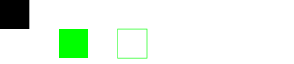

`<use>`元素可以在SVG内其他任何地方复用，包括`<g>`和`<symbol>`内。复用的图形可以是被定义在`<defs>`(除非被使用时否则不会显示)内的也可以是没定义在`<defs>`内的。

下面例子看defs章节，一样。

# 使用defs外的元素

只要SVG内的元素具有唯一的id属性，`<use>`元素就可以复用他：

```HTML
<svg width="500" height="110">

    <g id="shape2">
        <rect x="0" y="0" width="50" height="50" />
    </g>

    <use xlink:href="#shape2" x="200" y="50" />

</svg>
```

例子中定义了一个内部含有`<rect>`的`<g>`元素，之后用`<use>`就可以用这个`<g>`(包括里面的`<rect>`)了。


注意原图和复用的都显示出来了，这是因为被复用的图形是没有被`<defs>`或者`<symbol>`元素包裹的`<g>`元素。

这里的蓝点也只是为了显示`<use>`元素的坐标。

# 设置 CSS 样式

如果原图没有style属性，那么复用时可以设置其CSS样式。直接在`<use>`元素内设置style属性即可：

```HTML
<svg width="500" height="110">

  <g id="shape3">
      <rect x="0" y="0" width="50" height="50" />
  </g>

  <use xlink:href="#shape3" x="100" y="50" style="fill: #00ff00;"/>
  <use xlink:href="#shape3" x="200" y="50" style="stroke: #00ff00; fill: none;"/>

</svg>
```

注意原图没有style属性，所以就渲染了默认样式(经典黑)。



