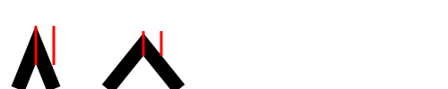
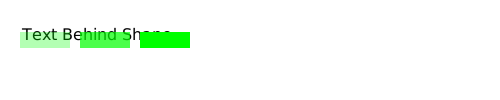

SVG使用stroke来画图形的轮廓。stroke是你可以给任意SVG图形使用的CSS属性之一。

# 样式属性

Stroke和fill都可以在style中指定：

```HTML
<circle cx="50" cy="50" r="50"
        style="stroke: #000066; fill: 3333ff;" />
```
例子中定义了一个有深蓝轮廓，浅蓝填充色的圆。

# Stroke 例子

```HTML
<circle cx="50" cy="50" r="25"
      style="stroke: #000000; fill:none;" />
```

例子中定义了一个有黑色轮廓并且没有填充的圆：


# Stroke 和 Fill 例子

你可以把SVG stroke和fill组合起来使用，下面是一个例子:

```HTML
<circle cx="50" cy="50" r="25"
        style="stroke: #000066; fill: #3333ff;" />
```

例子中定义了一个有深蓝轮廓，浅蓝填充色的圆。


# stroke-width

SVG的stroke-width CSS属性可以定义轮廓宽度。

```HTML
stroke-width: 3px;
```

例子定义了一个宽度为3像素的轮廓。你可以用SVG体系里支持的所有不同单位，不仅仅是px。

```HTML
<circle cx="50" cy="50" r="25"
        style="stroke: #000066; fill: none;
               stroke-width: 1px;" />

<circle cx="150" cy="50" r="25"
        style="stroke: #000066; fill: none;
               stroke-width: 3px;" />

<circle cx="250" cy="50" r="25"
        style="stroke: #000066; fill: none;
               stroke-width: 6px;" />

<circle cx="350" cy="50" r="25"
        style="stroke: #000066; fill: none;
               stroke-width: 12px;" />
```


# stroke-linecap

stroke-lincap定义了线段结尾处如何渲染，有三个可选值：
```
butt
square
round
```

butt会在末尾处截断线段。square很像butt不过会突出去一点。round会渲染一个圆形。

下面展示3种不同的值(sequence = butt, square, round):


该例定义了三个绿色stroke-width为10的线来展示stroke-linecap。每条绿色的线中都画有一条黑色的stroke-width为1的线。这些线与绿色线的x1y1 x2y2相同，但没有设置stroke-linecap。你可以清楚的看到其中的区别。

# stroke-linejoin

stroke-linejoin CSS 属性定义了两条线段相交时渲染的形状。stroke-linejoin有三个值可选：

```
miter
round
bevel
```

下面是例子：

```HTML
<path d="M20,100 l20,-50 l20,50"
      style="stroke: #000000;    fill:none;
             stroke-width:16px;
             stroke-linejoin: miter;" />
<text x="22" y="20">miter</text>

<path d="M120,100 l20,-50 l20,50"
      style="stroke: #000000;    fill:none;
             stroke-width:16px;
             stroke-linejoin: round;" />
<text x="122" y="20">round</text>

<path d="M220,100 l20,-50 l20,50"
      style="stroke: #000000;    fill:none;
             stroke-width:16px;
             stroke-linejoin: bevel;" />
<text x="222" y="20">bevel</text>    
```


# stroke-miterlimit

stroke-miterlimit 和 stroke-linejoin一起使用。如果stroke-linejoin设置为miter，那么就可以用此属性来限制两线相交时的距离，相交点一般会被拉长：

```HTML
<path d="M20,100 l20,-50 l20,50"
      style="stroke: #000000;    fill:none;
             stroke-width:16px;
             stroke-linejoin: miter;
             stroke-miterlimit: 1.0;
             " />
<text x="29" y="20">1.0</text>
<path d="M120,100 l20,-50 l20,50"
      style="stroke: #000000;    fill:none;
             stroke-width:16px;
             stroke-linejoin: miter;
             stroke-miterlimit: 2.0;
             " />
<text x="129" y="20">2.0</text>
<path d="M220,100 l20,-50 l20,50"
      style="stroke: #000000;    fill:none;
             stroke-width:16px;
             stroke-linejoin: miter;
             stroke-miterlimit: 4.0;
             " />
<text x="229" y="20">4.0</text>   
```

注意这三个不同的stroke-miterlimit值，没有的话这三条路径应该是一致的：


线段连接处的长度称为夹角长度。夹角长度的计算是从内边角开始直到连接点的边缘。下图可以看出来：



和你想的一样，轮廓越广，连接角越尖，夹角也越长。

stroke-miterlimit实际上限制的是夹角长度和轮廓宽度。因此，stroke-miterlimit设置为1也就意味着夹角长度最多是1倍的轮廓宽度，超过的部分会被剪裁。

下面都是用的stroke-miterlimit 1.0 但角度不同的例子：


当角度越大剪裁掉的夹角越大，这是因为角越尖生成的角越长。

# stroke-dasharray + stroke-dashoffset

stroke-dasharray属性用来渲染图形的虚线轮廓。称他为`dash array`的原因是你在写的时候需要写一组数字作为值。这些值定义的是虚线的长度和间隔空白，也就是说你赋值的时候个数都需要是双数。

```HTML
<line x1="20" y1="20" x2="120" y2="20"
      style="stroke: #000000; fill:none;
      stroke-width: 6px;
      stroke-dasharray: 10 5"  />
```

上面的例子中定义了一个宽度为10像素，间隔空白为5像素的虚线：


更多的例子：

```HTML
<line x1="20" y1="20" x2="120" y2="20"
      style="stroke: #000000; fill:none;
      stroke-width: 6px;
      stroke-dasharray: 10 5 5 5"  />

<line x1="20" y1="40" x2="120" y2="40"
      style="stroke: #000000; fill:none;
      stroke-width: 6px;
      stroke-dasharray: 10 5 5 10"  />
```

第一条线虚线宽是10，之后5像素间隔之后是5像素的宽5像素的间隔，然后循环。

第二个就是10 5 5 10的循环。


stroke-dashoffset用来设置虚线开始的点。比如你可以设置从虚线的一半处开始，之后的还是正常循环：

```HTML
<line x1="20" y1="20" x2="170" y2="20"
      style="stroke: #000000; fill:none;
      stroke-width: 6px;
      stroke-dasharray: 10 5;
      stroke-dashoffset: 5;
      "  />
```

例子中设置了dash-offset为5像素，表示渲染的虚线开始时会从5像素处开始：


# stroke-opacity

stroke-opacity属性用来设置轮廓的透明度。stroke-opacity需要一个十进制数字，范围为0-1。越靠近0越透明，越靠近1就越实心。默认是1，完全实心。

一些例子：

```HTML
<text x="22" y="40">Text Behind Shape</text>

<path d="M20,40 l50,0"
      style="stroke: #00ff00;    fill:none;
             stroke-width:16px;
             stroke-opacity: 0.3;
             " />

<path d="M80,40 l50,0"
      style="stroke: #00ff00;    fill:none;
             stroke-width:16px;
             stroke-opacity: 0.7;
             " />

<path d="M140,40 l50,0"
      style="stroke: #00ff00;    fill:none;
             stroke-width:16px;
             stroke-opacity: 1;
             " />
```



