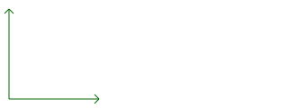
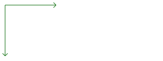

SVG的坐标系(以及其他大多数计算机图形的坐标系)与数学等的坐标系有一点点的不同。

# 数学/笛卡尔坐标系

在笛卡尔坐标系中，x=0,y=0的点在左下。当某个点的x增加时会向右移动，x减少时向左移动，y增加时向上移动，y减少时则向下移动。

例:

# SVG 坐标系

在SVG坐标系中，x=0,y=0的点处于左上角。y轴与正常的坐标系移动规则相反。当y增加时就会向下移动，反之向上。

例：

# 坐标系单位

在SVG坐标系中你可以对其中的内容(x,y,width,height等)指定任意单位，在值后面跟上单位即可，10cm 125mm。

如果你在值后面没有指定单位，默认单位会指定为px(像素)。

下面是单位描述:

单位 描述
em	font-size的大小，一个字符的高。
ex	字符x的高度。
px	像素
pt	点(Points) (1 / 72英寸)
pc	Picas (1 / 6英寸)
cm	厘米
mm	毫米
in	英寸

你设置在<svg>标签上的宽高属性只会影响<svg>元素自身(viewport)。<svg>里面的图形必须有自己的单位，如果没设置单位默认是px，如果没设置单位默认是px，如果没设置单位默认是px，重要的事情说三遍。